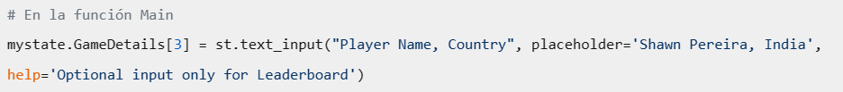
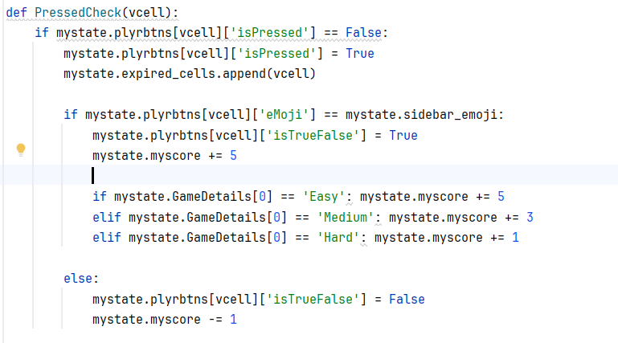
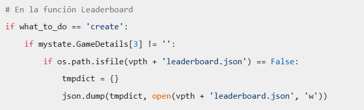
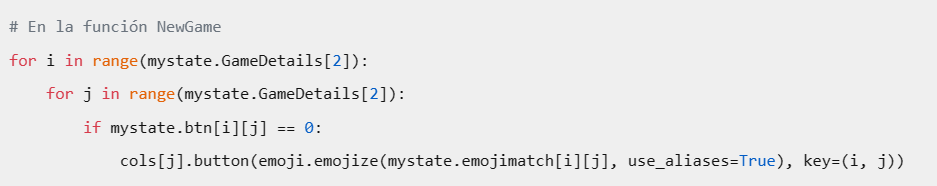
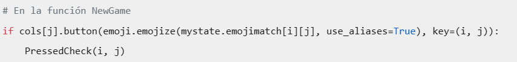
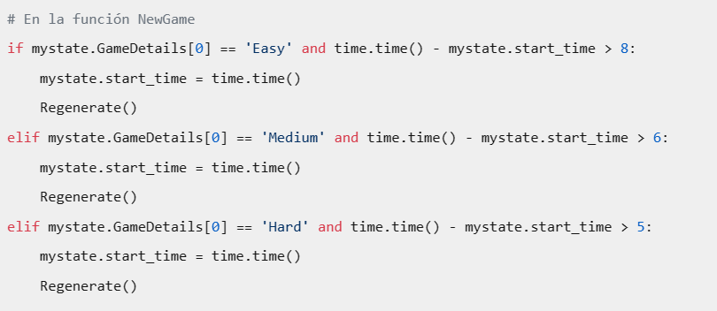
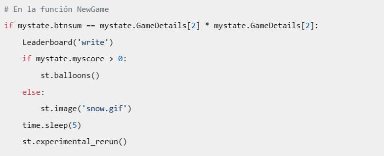
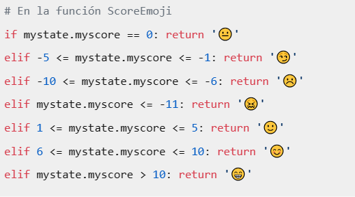
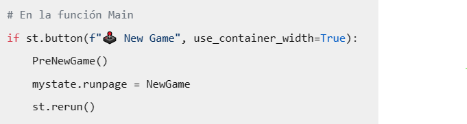

# Requistos vs código
## Requisitos Funcionales y Criterios de Aceptación

| Requisito y Criterios de Aceptación                                                                                                                                                                                                                                                                                                                                                                                                                                                                                                                                                                                                                                                                                          | Código/Imagen                                            |
|------------------------------------------------------------------------------------------------------------------------------------------------------------------------------------------------------------------------------------------------------------------------------------------------------------------------------------------------------------------------------------------------------------------------------------------------------------------------------------------------------------------------------------------------------------------------------------------------------------------------------------------------------------------------------------------------------------------------------|----------------------------------------------------------|
| **1. Configuración de Nivel de Dificultad** **Requisito:** El sistema debe permitir a los jugadores seleccionar el nivel de dificultad antes de comenzar el juego. **Criterios de Aceptación:** - Opciones de dificultad fácil, medio y difícil disponibles para selección. - La configuración de dificultad debe influir en la mecánica del juego, como la frecuencia de regeneración de imágenes y la puntuación. - Tiempos de regeneración específicos:   - Fácil: cada 8 segundos.   - Medio: cada 6 segundos.   - Difícil: cada 5 segundos.                                                                                                                                                     |                                   |
| **2. Inicialización del Tablero** **Requisito:** Al comenzar un juego, el sistema debe inicializar el tablero con un conjunto aleatorio de imágenes basado en la dificultad seleccionada. **Criterios de Aceptación:** - El tablero debe ser llenado con imágenes de emojis que corresponden a la dificultad elegida. - Ninguna imagen objetivo (emoji de la barra lateral) debe aparecer más de una vez en el tablero inicial. - La imagen objetivo debe ser seleccionada aleatoriamente y mostrada en la barra lateral.                                                                                                                                                                                     |    |
| **3. Parametrización del Nombre del Jugador y País** **Requisito:** El sistema debe permitir a los jugadores ingresar su nombre y país antes de comenzar el juego. **Criterios de Aceptación:** - Debe existir un campo de texto para que los jugadores ingresen su nombre y país. - Es posible que los campos de nombre y país estén vacíos, pero en ese caso no se muestra el _Leaderboard_ - La información del jugador debe persistir durante la sesión de juego.                                                                                                                                                                                                                                         |                               |
| **4. Gestión de Puntaje y Validación de Respuestas** **Requisito:** El sistema debe ser capaz de gestionar y actualizar el puntaje del jugador en tiempo real, basado en las respuestas del usuario durante el juego. **Criterios de Aceptación:** - Cada vez que un jugador selecciona una casilla en el tablero de juego, el sistema debe verificar si la selección es correcta o incorrecta comparándola con la imagen objetivo en la barra lateral. - Cada coincidencia correcta de imágenes dará al jugador +N puntos (donde N=5:Fácil, N=3:Medio, N=1:Difícil); cada coincidencia incorrecta de imágenes dará al jugador -1 punto. - Cada regeneración de imágenes tendrá una penalización de -1 punto. |                               |
| **5. Gestión de la Tabla de Líderes** **Requisito:** El sistema debe ser capaz de crear, actualizar y leer la tabla de líderes. **Criterios de Aceptación:** - Al final del juego, si el jugador ha proporcionado su nombre, la puntuación del jugador se añade a la tabla de líderes. - La tabla de líderes se ordena en orden descendente por la puntuación más alta. - La tabla de líderes solo mantiene las tres puntuaciones más altas.                                                                                                                                                                                                                                                                  |                               |
| **6. Gestión del Tablero de Juego** **Requisito:** El sistema debe ser capaz de generar y actualizar el tablero de juego. **Criterios de Aceptación:** - El tablero de juego es una cuadrícula N x N, donde N depende del nivel de dificultad seleccionado. - Cada celda del tablero de juego es un botón que muestra un emoji. - Los emojis para el tablero de juego se generan aleatoriamente al inicio del juego y se regeneran a intervalos específicos durante el juego.                                                                                                                                                                                                                                 |                               |
| **7. Selección de Imágenes** **Requisito:** El sistema permite a los jugadores seleccionar una imagen en el tablero de juego. **Criterios de Aceptación:** - Los jugadores pueden seleccionar una imagen haciendo clic en un botón del tablero de juego. - Cada botón del tablero de juego solo puede ser seleccionado una vez.                                                                                                                                                                                                                                                                                                                                                                                  |                               |
| **8. Regeneración de Imágenes** **Requisito:** El sistema regenera las imágenes del tablero de juego y la imagen objetivo en la barra lateral a intervalos específicos durante el juego. **Criterios de Aceptación:** - Las imágenes del tablero de juego y la imagen objetivo en la barra lateral se regeneran a intervalos específicos. - Los intervalos de regeneración dependen del nivel de dificultad seleccionado.                                                                                                                                                                                                                                                                                        |                               |
| **9. Finalización del Juego** **Requisito:** El sistema determina cuándo se ha completado el juego (cuando todos los botones han sido presionados) y muestra una animación de globos o nieve dependiendo de la puntuación del jugador. **Criterios de Aceptación:** - El juego se completa cuando todos los botones del tablero de juego han sido presionados. - Al final del juego, se muestra una animación de globos si la puntuación del jugador es positiva, o una animación de nieve si la puntuación del jugador es cero o negativa.                                                                                                                                                                      |                               |
| **10. Visualización de Emojis de Puntuación** **Requisito:** El sistema muestra un emoji correspondiente a la puntuación actual del jugador. **Criterios de Aceptación:** - El sistema muestra un emoji que refleja la puntuación actual del jugador. - Los emojis varían dependiendo de si la puntuación del jugador es positiva, negativa o cero.                                                                                                                                                                                                                                                                                                                                                              |                             |
| **10. Reinicio del Juego** **Requisito:** El sistema permite a los jugadores reiniciar el juego y volver a la página principal. **Criterios de Aceptación:** - Los jugadores pueden reiniciar el juego y volver a la página principal haciendo clic en el botón "Nuevo juego" en la barra lateral.                                                                                                                                                                                                                                                                                                                                                                                                                  |                             |                                                                                                                                                                | `Código para la visualización de emojis de puntuación` |  